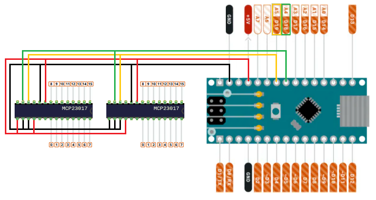

# DIYDUINO HOTAS

A project to create a DIY HOTAS throttle controller from any Arduino or Arduino compatible board. The program can be used to create almost any kind of Arduino based controller.

If you have an Arduino Leonardo or Pro Micro, you don't need this project. These boards can act as an input device, without the need for custon drivers.

## Description

This project consists of two parts:
- [Controller](arduino/README.md) and
- the [driver](driver/README.md).

The controller is the software flashed to the Arduino, while the driver is used to communicate with a virtual controller driver [vJoy](https://github.com/shauleiz/vJoy).

## Requirements

- Any Arduino compatible board
- Microsoft Windows 7, 8 or 10
    - [vJoy](https://github.com/shauleiz/vJoy)
    - Python 3 (For the driver)

**Linux support is planned, but requires a different driver**

---

## Example Circuit with MCP23017 expansion

#### Arduino

Analog axis are connected to **A0-A7**[^1]

Buttons and switches can be connected to
- **D2-D12**
- **D13** is the internal LED
- **D14-D19** Are A0-A5 in digital mode.[^1]
- Further digital input can be added with **MCP23017** chips

#### MCP23017 Chips

Use [Adafruit MCP23017 Library](https://github.com/adafruit/Adafruit-MCP23017-Arduino-Library/tree/master)

- Both MCP23017 **SDA** are connected to **A5**
- Both MCP23017 **SCK** are connected to **A4**
- Both MCP23017 **VSS** is connected to **GND**
- Both MCP23017 **VDD** is connected to **+5V**

- MCP23017 **(1) A0, A1, A2** are connected to **GND**
- MCP23017 **(2) A0** is connected to **+5V**
- MCP23017 **(2) A1, A2** are connected to **GND**

- GPA0-GPA7 (0-7) are digital input
- GPB0-GPB7 (8-15) are digital input

   

[^1]: **Note!** If you need expansion chips, **A4** and **A5** are used for **I2C** communication
